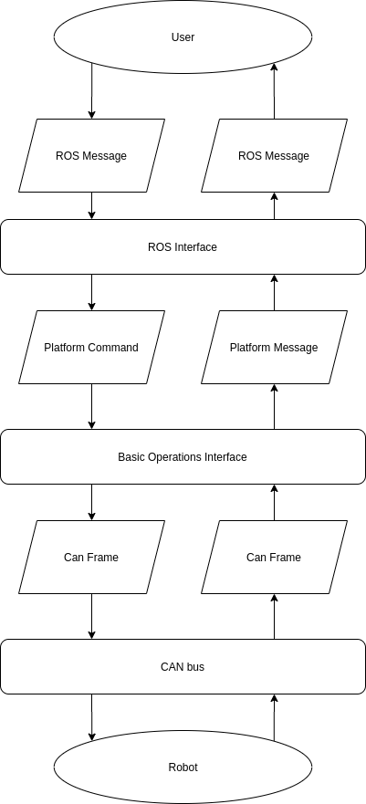

<<<<<<< HEAD:docs/_sources/_overview/overview.rst.txt
Overview of Robots
==================
=======
Mobile Robot System
===================
This page is meant to give a brief overview of the platforms used in Weston Robot and the packages developed by Weston Robots

.. contents::
   :depth: 2
   :local:

System Structure
----------------

>>>>>>> refs/remotes/origin/pd_dev:source/_general/mobile_robot_system.rst
In general, most of the robots have an on-board embedded controller that will manage the low level control of individual motors 
to achieve a desired control input (velocity and steering angle/angular velocity).

The desired control input can be sent to the embedded controller in 3 main ways:

1. Remote controller via radio frequency
2. A physical connection via CAN bus
3. A physical connection via Serial bus

<<<<<<< HEAD:docs/_sources/_overview/overview.rst.txt
Furthermore, the embedded controller is also able to communicate the state of the platform, such as measured velocities, temperature, currents etc, to an external computer via the CAN or Serial bus. 
=======
Furthermore, the embedded controller is also able to communicate the state of the platform to an external computer via the CAN or Serial bus. 
For most platforms, the On-board embedded controller send back messages on state of the platform, 
such as measured velocities, temperature, currents etc. 

Hardware Interface
------------------

CAN/Serial interface
^^^^^^^^^^^^^^^^^^^^

Information on CAN bus can be found in https://www.youtube.com/watch?v=FqLDpHsxvf8 and https://en.wikipedia.org/wiki/CAN_bus.

Many protocols for communication through the CAN bus is similar for different platforms. 
As such, a abstract class `MobileBase` was designed as the super class of the CAN interface class for each robot model.

On the level of `MobileBase` the following is settled:

1. Setting up CAN connection
2. Disconnecting CAN connection 
3. Maintaining stream of CAN Frames

Setting up CAN connection
*************************

During the setting up of CAN connection, the protocol used to read the CAN Frame will be set. 
Since each platform will process CAN Frames differently, each platform will write its own ParseCANFrame(can_frame *rx_frame) function. 
The calling 
>>>>>>> refs/remotes/origin/pd_dev:source/_general/mobile_robot_system.rst

Overview of software Packages
-----------------------------
This segment is an overview of the packages and aims to aid you when navigating through the different packages.

<<<<<<< HEAD:docs/_sources/_overview/overview.rst.txt
The software pacakges provided by Weston Robots aim to achieve the following:
1. Handle the low level communication between the computer and the embedded controller in the robots
2. Provide and interface between ROS messages and communicating with the robots
3. Occasionally, support for simulations (espescailly in webots) is provided
=======
Disconnecting CAN connection 
****************************
>>>>>>> refs/remotes/origin/pd_dev:source/_general/mobile_robot_system.rst

Package Naming
--------------
* wrp_sdk: This SDK deals with the low level communication between the computer and the robot platofrm via CAN and Serial bus. Currently, this SDK supports the platforms Hunter,Scout and Tracer.

* <platform_name>_base: These SDKs provide the interface between ROS and wrp_sdk. Essentially, these SDKs simplify the creating of a ROS node for the platform that translates ROS messages, such as cmd_vel, into  platform-unique messages to each platform. These SDKs utilise tools from wrp_sdk to convert these platform-unique messaages into CAN or serial Messages. As a user of our SDKs, you will largely only interact with the libraries created in the <platform_name>_base SDKs. 

<<<<<<< HEAD:docs/_sources/_overview/overview.rst.txt
Example
-------
To give a clearer overview on the purpose of the package, a sample scenario for using these SDKs is described below:

* You are using the scout platform with a LIDAR module attachced to it. 
* You would like to use the ROS navigation stack to control the scout platform in a mapped region using the inputs from the LIDAR module.
* Using the LIDAR's own software package, a LIDAR node in ROS is created the publsihes a /scan data.
* Using the Scout_Base SDK, a node is created that subscribes to /cmd_vel topics and publishes /odom topic. 
* Based on the position which the LIDAR is mounted, a .xacro file for the trasnform between the platform and the LIDAR is created.

With this, ROS navigation stack is able to navigate the robot based on the provided map.

This specific example has been implemented and can be found in TODO: link to scout_nav package

=======

Testing CAN connection
***********************

After connecting the robot and the computer via the CAN bus, an additional device should show up from the commands::

   $ ifconfig -a

The new device should be identified as:: 

   can#: flags=.....

whereby # is a number, usually # = 0. For the segments below, it is assumed that the connection occurs at can0.
If this occurs, it indicates that the computer is actually connected to the robot via the CAN bus. 
You can attempt to read the data being sent via the CAN bus using:: 

   $ candump can0

If the comuunication is working properly, a stream of hexamdeximal should be flooding the command line. If instead the message:: 

   read: Network is down 

is shown, it indicates that TODO: not sure exactly what is indicates::

   $ sudo ip link set can0 up type can bitrate 500000

could fix this issue
>>>>>>> refs/remotes/origin/pd_dev:source/_general/mobile_robot_system.rst

Further debugging of CAN
*************************
If the CAN communication between the computer andn the platform is still unable to occur, there might be a hardware fault on the robot platform
affecting the CAN communication. The followign websites provide a simple overview on how you could go about debugging the hardware on the robot platform.

https://www.ti.com/lit/an/slyt529/slyt529.pdf?ts=1600396027624&ref_url=https%253A%252F%252Fwww.google.com%252F

https://www.ti.com/lit/an/slyt529/slyt529.pdf?ts=1600396027624&ref_url=https%253A%252F%252Fwww.google.com%252F

https://support.enovationcontrols.com/hc/en-us/articles/360038856494-CAN-BUS-Troubleshooting-Guide-with-Video-

A simple set of instructionss is given below. These instructions assume basic knnowledge on electrical engineering ad circuits. Furthermore, it is assumed that you have read through the links given Above

1. The robot platforms Scout and Hunter do not have termination resistors between the CAN HI and LO terminals. As such:
a. If would discnnect all peripherals from the robot, and measure the resistance betwweenn CAN HI and LO terminals, a reading of about 50 M ohms or even nopenn circuit is expected.
b. The computer connected to the platform should contain a terminationn resistor of 120 ohms. (If the board provided by weston robots is used, a jumper can be used to attach/dettacch the 120 ohm resistor.

2. With the platform switched off, test the connectivity between corresponding pins of the CAN interface. i.e. Test that CAN HI on all CAN interfaces are connected to each other.
If the different ports are not connected, there is likely ann internal wiring issue with the platform

3. With all peripherals plugged in, and
ROS Interface
-------------

The libraries / packages is designed to bridge the communication between the a embedded controller on the mobile platforms 
and a higher level ROS environnement on a computer. 

In summary, the packages written here converts ROS messages to CAN frames / Serial outputs and back.

The conversion from ROS message to CAN frame occurs in two main steps as shown in the flow chart.

Moving down the flow chart:

1. The ROS interface will create a node that listens for ROS messages of a specified ROS topic. 

2. The information in the ROS message will be translated into a platform-unique C++ data structure known as a Platform Command. 

3. The Basic Operation package contains the subroutines required to translate these platform into CAN frames. 

4. Furthermore, the package handles the communication of the CAN frame through the CAN bus.

Moving up the flow chart:
1. The Basic Operations Interface will also contain the subroutines required to read the CAN frames and translate them 
into platform-unique Platform Messages. 

2. These messages can then be translated into ROS messages by the ROS interface. 

3. The ROS interface will also handle publishing of these messages to the appropriate ROS topic. 

